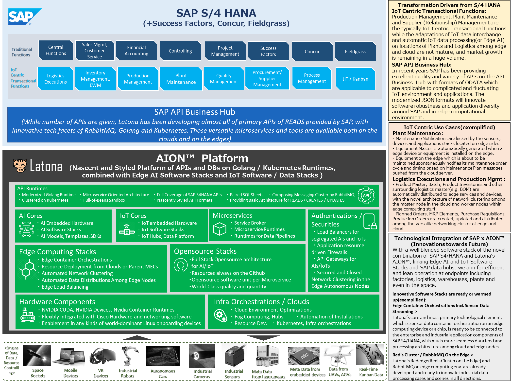

# aion-sap-integrations-architecture
aion-sap-integrations-architecture は、SAP API Business Hub を活用した、SAP と AION における統合コンセプトです。

## 概要
SAP API Business Hub では、IoT環境とアプリケーションに適用できる ODATA 形式の API が提供されています。  
aion-sap-integrations-architecture では、SAP API Business Hub の API をフル活用し主にエッジコンピューティングのランタイム環境におけるSAPとのインテグレーションを開発しています。

## AIONとSAPとの統合アーキテクチャ

   

## クラウド環境での利用
aion-sap-integrations-architecture は、クラウド環境においてSAPと統合する場合にも、利用可能なように設計されています。

## aion-sap-integrations-architectureが対応するSAPソリューション
aion-sap-integrations-architecture は、SAP S/4HANA における以下の各モジュールに加えて、SAP SuccessFactors、SAP Concur、SAP Fieldgrassに対応されています。

### SAP S/4HANA  

* Central Functions
* Sales Mgmt, Customer Service
* Financial Accounting
* Controlling
* Project Management
* Logistics Executions
* Inventory Management, EWM
* Production Management
* Plant Maintenance
* Quality Management
* Procurement/ Supplier Management
* Process Management
* JIT / Kanban

### SAP SuccessFactors 
### SAP Concur  
### SAP Fieldgrass  

